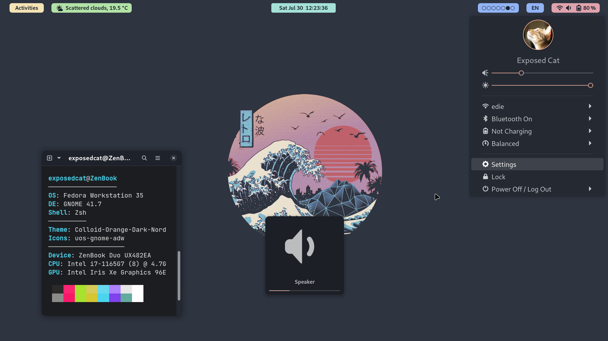

<h1 align="center">GNOME DE - Lo-Fi</h1>

Tools, configs, themes, etc. to make GNOME DE look really wonderful 

## Other configs
Check out also my [Dotfiles repo](https://github.com/ExposedCat/dotfiles) for some linux-related configs

## Instructions

### configs/gtk.css
#### Description
Small fixes of GTK apps elements:
1. Added GNOME Terminal padding
3. Removed dashed line: Removed scrollable window dashed line (scrollable box indicator)
#### Usage
Download file to `~/.config/gtk-3.0`:  
`wget https://raw.githubusercontent.com/ExposedCat/stunning-gnome-de/lo-fi/configs/gtk.css`  
`mv gtk.css ~/.config/gtk-3.0/gtk.css`

### assets/JetBrainsMonospace.ttf
#### Description
Monospace font with emoji support
#### Usage
1. Download font:
`wget https://raw.githubusercontent.com/ExposedCat/stunning-gnome-de/lo-fi/assets/JetBrainsMonospace.ttf`  
2. Install font, enable it in Tweaks → Fonts as `Monospace` font:
`gnome-font-viewer ./JetBrainsMonospace.ttf`  
3. \[Optional] Remove font file:
`rm ./JetBrainsMonospace.ttf`

### theme.zip
#### Description
GTK and GNOME Shell theme, defines shell and applications appearance.
#### Usage
1. Enable [User Themes extension](https://extensions.gnome.org/extension/19/user-themes/)
2. Download archive:  
`wget https://raw.githubusercontent.com/ExposedCat/stunning-gnome-de/lo-fi/assets/theme.zip`
3. Extract files to `~/.themes`:  
`unzip theme.zip -d ~/.themes`
4. \[Optional] Remove archive:  
`rm theme.zip`
5. Apply as `Applications theme` and `Shell theme` in Tweaks → Appearance

### icons.zip
#### Description
Icon theme, defines set of system and application icons
#### Usage
1. Download archive:  
`wget https://raw.githubusercontent.com/ExposedCat/stunning-gnome-de/lo-fi/assets/icons.zip`
2. Extract files to `~/.icons`:  
`unzip icons.zip -d ~/.icons`
3. \[Optional] Remove archive:  
`rm icons.zip`
4. Apply as `Icons theme` in Tweaks → Appearance
4. Apply as `Cursor theme` in Tweaks → Appearance

### [extensions.md](extensions.md)
#### Description
List of useful extensions. Fewer extensions installed = better, so only install the ones you think are needful
#### Usage
You can install any of them by links from [this file](extensions.md)
